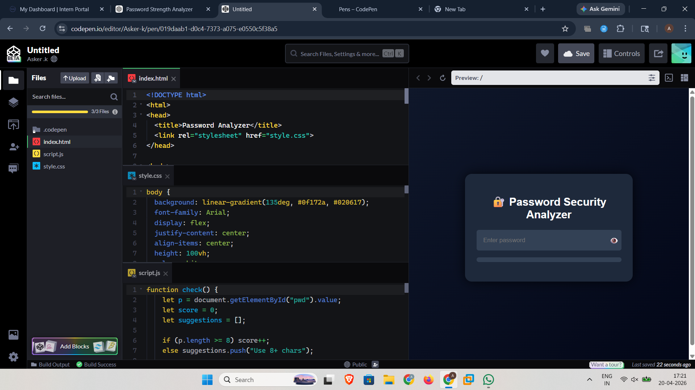

# 🔐 Password Strength Analyzer

A simple web-based tool that evaluates password strength in real time.

---

## 🚀 Features
- Detects weak, medium, and strong passwords  
- Checks:
  - Length  
  - Uppercase & lowercase letters  
  - Numbers  
  - Special characters  
- Provides suggestions to improve password security  
- Visual strength indicator (color bar)  

---

## 🛠 Tech Stack
- HTML  
- CSS  
- JavaScript  

---

## 📸 Demo

  

---

## 🔗 Live Demo
👉 [Try it on CodePen](https://codepen.io/Asker-k/pen/019daab1-d0c4-7373-a075-e0550c5f38a5)

---

## 📌 Purpose
This project demonstrates basic cybersecurity principles related to password security and user awareness.

---

## ⭐ Future Improvements
- Add password breach check (Have I Been Pwned API)
- Add entropy calculation
- Dark mode UI
